# نظام ERP — الدليل الكامل

نظام إدارة مشتريات واحتساب تكلفة البضاعة الواصلة (Landed Cost) للتجارة والاستيراد.
يحسب تكلفة كل صنف بعد توزيع مصاريف الشحن والجمارك، ويقترح أسعار البيع لكل وجهة.

**الموقع المباشر:** <https://fikradigital.online>

---

## المحتويات

1. [نظرة عامة](#1-نظرة-عامة)
2. [التشغيل والتنصيب](#2-التشغيل-والتنصيب)
3. [النشر على السيرفر](#3-النشر-على-السيرفر)
4. [أول تشغيل والتفعيل](#4-أول-تشغيل-والتفعيل)
5. [تنظيم العمل — الترتيب الصحيح](#5-تنظيم-العمل--الترتيب-الصحيح)
6. [شرح الشاشات](#6-شرح-الشاشات)
7. [المعادلات المعتمدة](#7-المعادلات-المعتمدة)
8. [الاستيراد والتصدير من Excel](#8-الاستيراد-والتصدير-من-excel)
9. [النسخ الاحتياطي](#9-النسخ-الاحتياطي)
10. [الصلاحيات والمستخدمون](#10-الصلاحيات-والمستخدمون)
11. [اختصارات لوحة المفاتيح](#11-اختصارات-لوحة-المفاتيح)
12. [حل المشاكل](#12-حل-المشاكل)

---

## 1. نظرة عامة

| البند               | التفصيل                                                                                            |
| ------------------- | -------------------------------------------------------------------------------------------------- |
| **الغرض**           | تسجيل أوامر الشراء، توزيع المصاريف على الأصناف، احتساب التكلفة النهائية للكرتون، واقتراح سعر البيع |
| **الواجهة**         | عربية بالكامل (RTL) بنمط ERP كلاسيكي (شريط أوامر + جداول قابلة للتحرير)                            |
| **مكان البيانات**   | داخل متصفح الجهاز (localStorage) — لكل مستخدم مساحته الخاصة، مع نسخ احتياطي سحابي اختياري          |
| **العملة المرجعية** | الدولار الأمريكي (USD) — كل التكاليف تُحتسب به مهما كانت عملة الفاتورة                             |
| **التقنيات**        | TanStack Start · React · TypeScript · Tailwind · Nitro · Electron (نسخة سطح المكتب)                |

### الشاشة الرئيسية

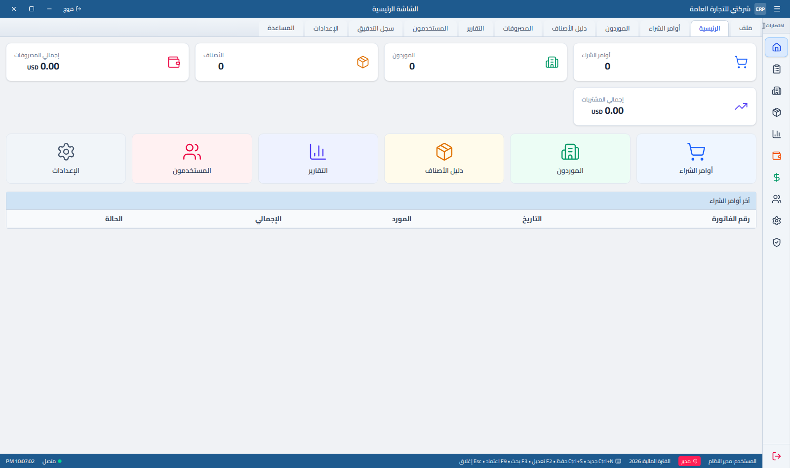

---

## 2. التشغيل والتنصيب

### المتطلبات

- **Node.js 20** أو أحدث (`node -v`)
- **npm** (يأتي مع Node)
- للنشر على سيرفر: **nginx** + **pm2**

### التشغيل على جهازك (وضع التطوير)

```bash
git clone https://github.com/z1kari2a/arabs-clone-magic.git
cd arabs-clone-magic
npm install
npm run dev
```

ثم افتح العنوان الذي يظهر في الطرفية (عادة `http://localhost:8080`).
أي تعديل على الكود ينعكس فوراً بلا إعادة تشغيل.

### بناء نسخة الإنتاج

```bash
npm run build          # يُنتج مجلد .output
PORT=8080 node .output/server/index.mjs
```

### نسخة سطح المكتب (Windows / Linux)

```bash
npm run electron:start        # تشغيل مباشر
npm run electron:build:win    # ملف تنفيذي لويندوز → electron-release/
npm run electron:build:linux  # ملف تنفيذي للينكس
```

نسخة سطح المكتب تخزّن البيانات في ملف محلي عبر جسر `erpNative` بدل المتصفح — نفس الوظائف تماماً.

### نسخة ويندوز المثبَّتة (تعمل بلا إنترنت)

```bash
npm run make:setup     # يبني البرنامج ثم يغلّفه في ERP-Setup-<الإصدار>.exe
```

| البند                                     | التفصيل                                                                     |
| ----------------------------------------- | --------------------------------------------------------------------------- |
| **الاتصال**                               | لا تحتاج إنترنت إطلاقاً — كل طلبات الشبكة محجوبة داخل التطبيق               |
| **قاعدة البيانات**                        | تُنشأ عند أول تشغيل في `%APPDATA%\erp\erp.db` (SQLite)                      |
| **إن تعذّر SQLite**                       | يتحوّل البرنامج تلقائياً إلى ملف `erp.json` بدل أن يتوقف، مع تنبيه للمستخدم |
| **إن كان مجلد المستخدم غير قابل للكتابة** | يُنشئ القاعدة في `Documents\ERP`                                            |
| **النسخ الاحتياطي**                       | نسخة تلقائية عند كل تشغيل وكل 6 ساعات في `backups\` (آخر 14 نسخة)           |
| **عند إزالة البرنامج**                    | مجلد البيانات يبقى كما هو — إعادة التثبيت تلتقطه                            |

### أوامر أخرى

| الأمر             | الوظيفة                    |
| ----------------- | -------------------------- |
| `npm run lint`    | فحص جودة الكود             |
| `npm run format`  | تنسيق الكود                |
| `npm run preview` | معاينة نسخة الإنتاج محلياً |

---

## 3. النشر على السيرفر

النظام منشور على **fikradigital.online** بهذه البنية:

```
المتصفح ──HTTPS──► nginx ──proxy──► localhost:8080 ──► pm2 «erp» ──► .output/server/index.mjs
```

### النشر بأمر واحد

```bash
./scripts/deploy.sh
```

يقوم بـ: **البناء** ← **إعادة تشغيل pm2** ← **التأكد أن الموقع يرد 200** قبل أن يعلن النجاح.
إن فشل، يعرض آخر 30 سطراً من سجلات pm2.

### الإعداد الأولي للسيرفر (مرة واحدة)

**1. تشغيل التطبيق تحت pm2:**

```bash
cd /root/arabs-clone-magic
npm install && npm run build
PORT=8080 HOST=0.0.0.0 pm2 start .output/server/index.mjs --name erp
pm2 save && pm2 startup     # ليعود تلقائياً بعد إعادة تشغيل السيرفر
```

**2. إعداد nginx** — الملف `/etc/nginx/sites-available/erp`:

```nginx
server {
    server_name fikradigital.online www.fikradigital.online;
    location / {
        proxy_pass http://localhost:8080;
        proxy_set_header Host $host;
        proxy_set_header X-Real-IP $remote_addr;
        proxy_set_header X-Forwarded-For $proxy_add_x_forwarded_for;
        proxy_set_header X-Forwarded-Proto $scheme;
    }
    listen 443 ssl;
    ssl_certificate     /etc/letsencrypt/live/fikradigital.online/fullchain.pem;
    ssl_certificate_key /etc/letsencrypt/live/fikradigital.online/privkey.pem;
}
```

```bash
ln -s /etc/nginx/sites-available/erp /etc/nginx/sites-enabled/
nginx -t && systemctl reload nginx
certbot --nginx -d fikradigital.online -d www.fikradigital.online   # شهادة SSL
```

### أوامر المتابعة

| الأمر             | الوظيفة                 |
| ----------------- | ----------------------- |
| `pm2 list`        | حالة التطبيق            |
| `pm2 logs erp`    | السجلات المباشرة        |
| `pm2 restart erp` | إعادة تشغيل             |
| `pm2 monit`       | مراقبة الذاكرة والمعالج |

> ⚠️ **لا تشغّل التطبيق يدوياً** بـ `node` أو `nohup` بينما pm2 يشغّله — النسختان تتصارعان على المنفذ 8080.

---

## 4. أول تشغيل والتفعيل

### إنشاء حساب المدير

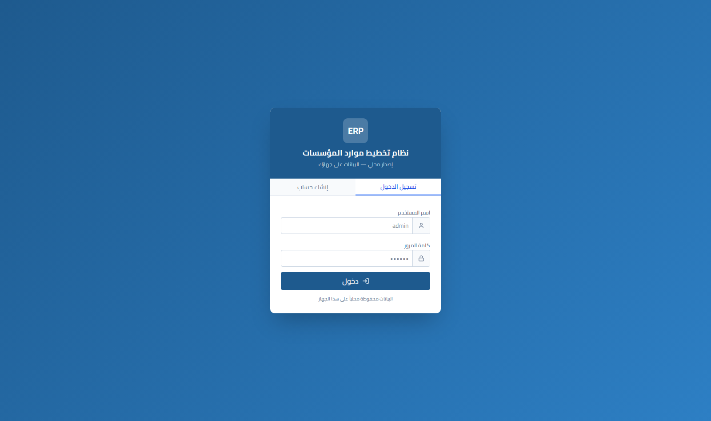

عند أول فتح للنظام لا يوجد أي مستخدم، وتفتح الشاشة مباشرة على **«أول تشغيل: أنشئ حساب المدير»**.
أنشئ حساباً — **أول حساب يُنشأ يصبح «مدير» تلقائياً** وبصلاحيات كاملة وبلا انتظار موافقة.

> لا يوجد أي حساب جاهز أو كلمة مرور افتراضية. أنت من يحدّد اسم المستخدم وكلمة المرور عند أول تشغيل.

### تسجيل المستخدمين اللاحقين

- من يسجّل بنفسه يبقى **«قيد المراجعة»** ولا يستطيع الدخول حتى يوافق عليه المدير من شاشة **المستخدمون**.
- المدير يستطيع إنشاء حسابات مباشرة (نشطة فوراً) وتحديد دورها.

### التفعيل (الترخيص)

نسخة سطح المكتب المحمية تطلب **رمز ترخيص** عند أول تشغيل، ثم:

1. تفعّل الرمز على خادم التراخيص وتربطه بمعرّف الجهاز.
2. تنزّل حزمة التطبيق المشفّرة وتشغّلها.
3. ترسل نبضة (heartbeat) كل 30 دقيقة — إن أُلغي الترخيص يتوقف التطبيق.

إدارة التراخيص من `/admin/licenses` (للمدير): إنشاء رمز، تحديد النوع (شهري / دائم)، ومتابعة الأجهزة المفعّلة وإلغاء تفعيلها.

> نسخة الويب على fikradigital.online تعمل بلا ترخيص، لكن **النسخ الاحتياطي السحابي يتطلب ترخيصاً مفعّلاً**.

---

## 5. تنظيم العمل — الترتيب الصحيح

شاشة أمر الشراء مرقّمة بخطوات ①→⑥ اتبعها بالترتيب:

```
① المورد  →  ② بيانات الفاتورة  →  ③ البنود  →  ④ المصروفات  →  ⑤ التكلفة  →  ⑥ التسعير
```

| الخطوة | الشاشة                                      | ماذا تفعل                                                            |
| ------ | ------------------------------------------- | -------------------------------------------------------------------- |
| **1**  | الموردون                                    | سجّل المورد (الاسم، الدولة، العملة)                                  |
| **2**  | الإعدادات ← أسعار الصرف                     | تأكد من أسعار العملات المستخدمة                                      |
| **3**  | الإعدادات ← التسعيرات                       | عرّف وجهات البيع ونسبها (عدن، صنعاء…)                                |
| **4**  | أمر الشراء ①                                | اختر المورد                                                          |
| **5**  | أمر الشراء ②                                | رقم الفاتورة، التاريخ، العملة، سعر الصرف، رقم الحاوية، طريقة التوزيع |
| **6**  | أمر الشراء ③                                | أدخل الأصناف (يدوياً أو استيراد Excel أو بحث من الكتالوج)            |
| **7**  | أمر الشراء ④                                | أدخل المصاريف (شحن، جمارك، نقل…) بأي عملة                            |
| **8**  | أمر الشراء ⑤                                | راجع التكلفة النهائية وسعر CBM                                       |
| **9**  | التسعيرات (زر «التسعيرات» F6 في أمر الشراء) | راجع أسعار البيع لكل وجهة، بأي عملة، مع الطباعة والتصدير             |
| **10** | حفظ (Ctrl+S) ثم اعتماد (F9)                 | الاعتماد يجمّد الفاتورة ويحدّث تكلفة الأصناف في الكتالوج             |

> **مهم:** الأصناف تُضاف إلى **دليل الأصناف** تلقائياً عند الحفظ، و**آخر تكلفة** تتحدّث فقط عند **الاعتماد**.

---

## 6. شرح الشاشات

### 6.1 الموردون


كود المورد، الاسم، الدولة، المدينة، الهاتف، البريد، **العملة** (تُستخدم افتراضياً في فواتيره)، وحالة التفعيل.

### 6.2 دليل الأصناف

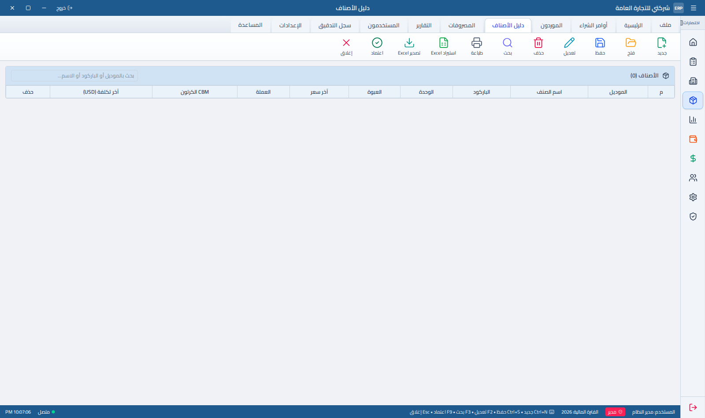

| الحقل           | المعنى                                          |
| --------------- | ----------------------------------------------- |
| الموديل         | كود الصنف (مفتاح فريد)                          |
| الباركود        | يُستخدم في البحث السريع                         |
| الوحدة / العبوة | اسم الوحدة وعدد الحبات داخل الطرد               |
| آخر سعر         | سعر الشراء الأخير                               |
| CBM الكرتون     | حجم الطرد الواحد بالمتر المكعب                  |
| آخر تكلفة (USD) | التكلفة النهائية للطرد من آخر فاتورة **معتمدة** |

### 6.3 أمر الشراء — الشاشة الأهم

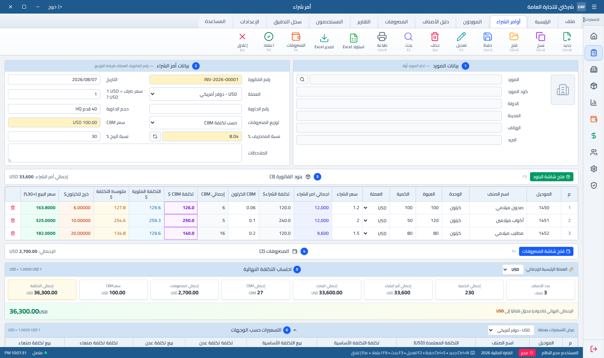

**أعمدة جدول البنود:**

| العمود            | يُدخل أم يُحسب | المعادلة                                         |
| ----------------- | -------------- | ------------------------------------------------ |
| الوحدة            | يُدخل          | كرتون / علبة / طرد… (التسمية لا تؤثر على الحساب) |
| العبوة            | يُدخل          | عدد الحبات داخل الطرد                            |
| الكمية            | يُدخل          | **عدد الطرود**                                   |
| سعر الشراء        | يُدخل          | سعر **الحبة** الواحدة                            |
| اجمالي امر الشراء | يُحسب          | الكمية × العبوة × سعر الشراء                     |
| تكلفة الشراء$     | يُحسب          | (سعر الحبة × العبوة) ÷ سعر الصرف                 |
| CBM الكرتون       | يُدخل          | حجم الطرد الواحد                                 |
| إجمالي CBM        | يُحسب          | الكمية × CBM الكرتون                             |
| تكلفة CBM $       | يُحسب          | تكلفة الشراء + (CBM الكرتون × سعر CBM)           |
| التكلفة المئوية $ | يُحسب          | تكلفة الشراء × (1 + نسبة المصاريف)               |
| متوسط التكلفة $   | يُحسب          | متوسط الطريقتين                                  |
| خرج للكرتون$      | يُحسب          | نصيب الطرد من المصاريف                           |
| سعر البيع         | يُحسب          | التكلفة المعتمدة × (1 + نسبة الربح)              |

الجدول يظهر **في مكانين بنفس التصميم**: أسفل سطره في الصفحة، وداخل شاشة منبثقة أوسع (F3) — ومصدر البيانات واحد، فالتعديل في أحدهما يظهر في الآخر فوراً.

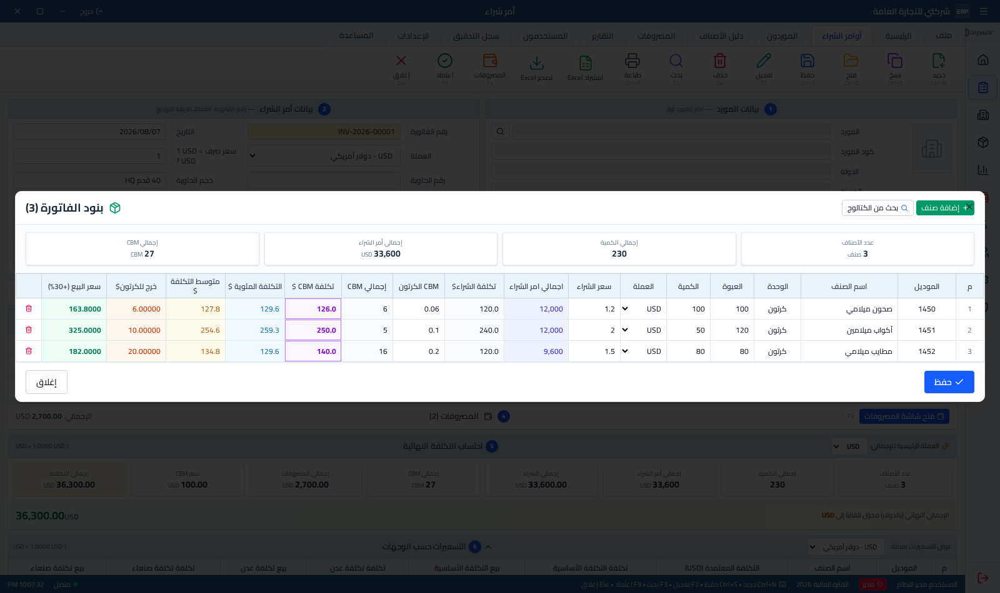

**طرق توزيع المصاريف** (تُختار من ②):

| الطريقة                 | متى تستخدمها                            |
| ----------------------- | --------------------------------------- |
| **حسب تكلفة CBM**       | الأنسب للشحن البحري — التوزيع حسب الحجم |
| **حسب التكلفة المئوية** | التوزيع حسب قيمة البضاعة                |
| **حسب متوسط التكلفة**   | حل وسط بين الاثنتين                     |

### 6.4 شاشة المصروفات المنبثقة (F4)

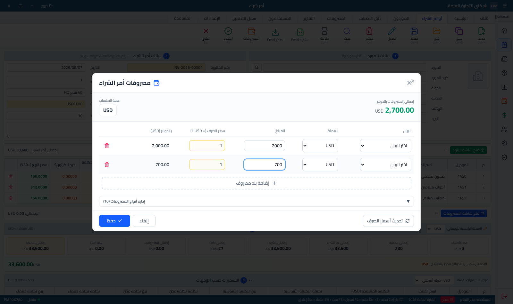

كل بند مصروف: البيان، العملة، المبلغ، سعر الصرف. المجموع بالدولار يظهر أعلى النافذة، ويُوزَّع على الأصناف حسب الطريقة المختارة. زر **حفظ** يخزّن المصروفات على الفاتورة مباشرة إن كانت محفوظة من قبل.

> أسعار الصرف **تُثبَّت** على المستند لحظة الحفظ — تعديل جدول العملات لاحقاً لا يغيّر الفواتير القديمة.

### 6.5 المصروفات (تقرير)

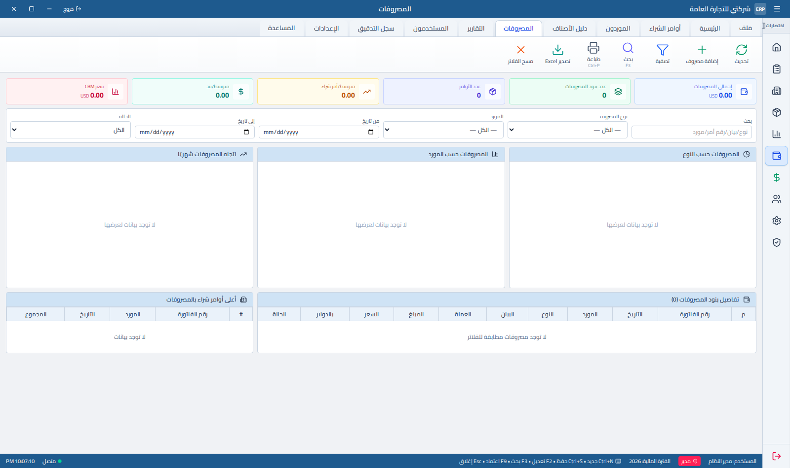

تجميع كل المصاريف من كل الفواتير مع فلاتر (النوع، المورد، التاريخ، الحالة) ورسوم بيانية حسب النوع والمورد والشهر.

### 6.6 التقارير

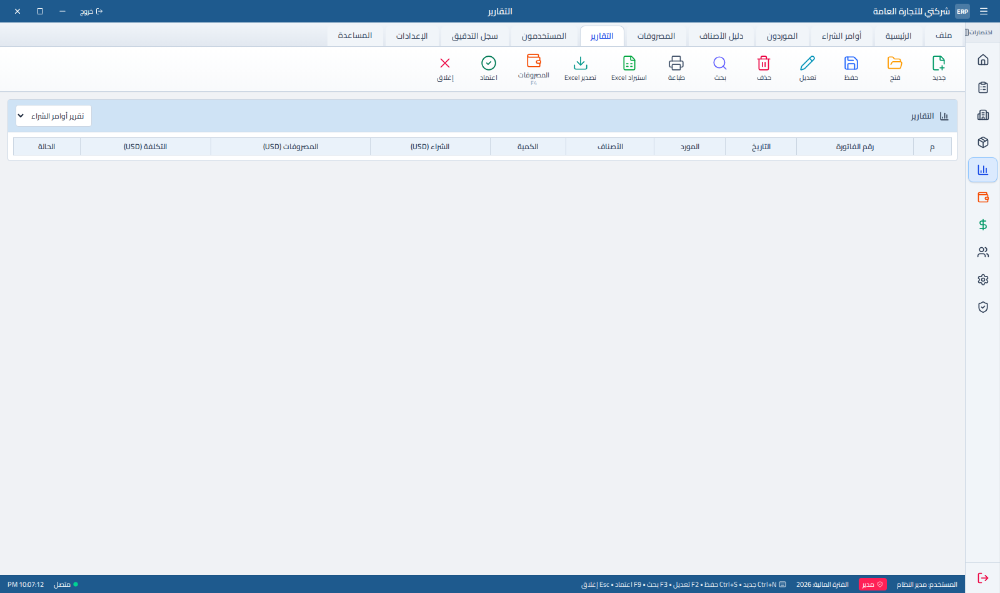

تقارير المشتريات والتكاليف والأصناف مع إمكانية التصدير.

### 6.7 أسعار الصرف

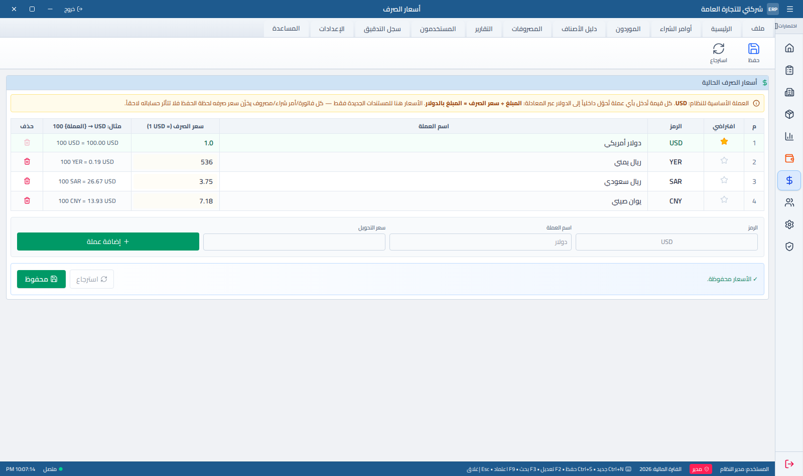

قاعدة الحساب: **`السعر` = عدد وحدات العملة مقابل 1 دولار**. مثال: `CNY = 7.2` يعني 7.2 يوان للدولار. التحويل للدولار دائماً = `المبلغ ÷ السعر`.

### 6.8 المستخدمون

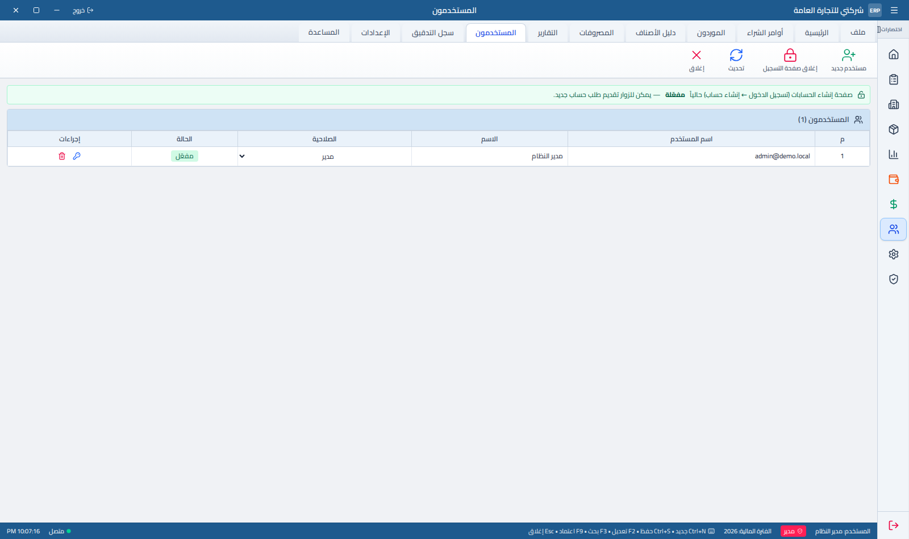

الموافقة على التسجيلات المعلّقة، تغيير الأدوار، تفعيل/تعطيل الحسابات.

### 6.9 الإعدادات

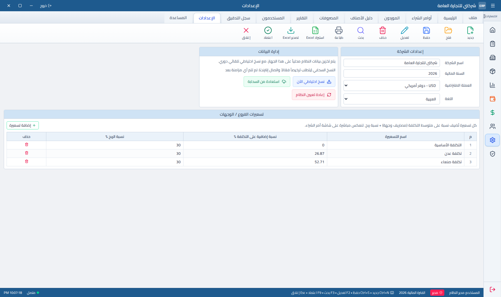

- **إعدادات الشركة:** الاسم، السنة المالية، العملة الافتراضية، اللغة
- **إدارة البيانات:** نسخ احتياطي الآن · استعادة من السحابة · إعادة تعيين النظام
- **هوية التطبيق:** اسم البرنامج وأيقونته — انظر أدناه
- **تسعيرات الفروع/الوجهات:** لكل وجهة نسبة إضافية على التكلفة + نسبة ربح، تنعكس مباشرة في جدول ⑥

#### تغيير اسم التطبيق وأيقونته

من **الإعدادات ← هوية التطبيق (الاسم والأيقونة)**:

| الحقل           | الأثر                                                                                                                         |
| --------------- | ----------------------------------------------------------------------------------------------------------------------------- |
| **اسم التطبيق** | شريط عنوان البرنامج، وعنوان النافذة في ويندوز، وتبويب المتصفح في نسخة الويب. اتركه فارغاً للعودة إلى الاسم الافتراضي          |
| **الأيقونة**    | صورة PNG/JPG/WebP/SVG تُصغَّر تلقائياً إلى 256×256. تظهر في شريط العنوان، وأيقونة النافذة وشريط المهام، وأيقونة تبويب المتصفح |

الاسم والأيقونة يُحفظان ضمن إعدادات الحساب نفسها، فيُزامنان تلقائياً إلى بقية الأجهزة مع
النسخ الاحتياطي السحابي، ويعودان كما هما عند الاستعادة على جهاز جديد. في نسخة سطح المكتب
تُحفظ نسخة منهما أيضاً في `branding.json` داخل مجلد بيانات البرنامج، حتى تفتح النافذة
بالاسم والأيقونة الصحيحين من اللحظة الأولى قبل أن تُحمَّل الواجهة.

> **ما لا يتغيّر من هنا:** أيقونة ملف التثبيت `ERP-Setup.exe` وأيقونة الاختصار على سطح
> المكتب مدمجتان داخل ملف البرنامج التنفيذي نفسه. لتغييرهما استبدل `public/app-icon.png`
> ثم:
>
> ```bash
> npm run icon        # يولّد build/icon.ico و public/favicon.ico من الصورة الجديدة
> npm run make:setup  # يعيد بناء البرنامج والمثبّت بالأيقونة الجديدة
> ```

### 6.10 سجل التدقيق

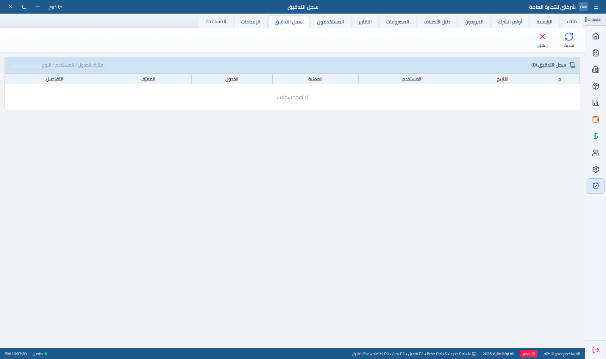

يسجّل كل إضافة/تعديل/حذف: المستخدم، الوقت، الجدول، القيمة قبل وبعد.

---

## 7. المعادلات المعتمدة

### سعر CBM — سعر موحّد للفاتورة كلها

```
سعر CBM = إجمالي المصاريف (بالدولار) ÷ إجمالي CBM لكل الأصناف
```

**مثال:** مصاريف 2,700 دولار · إجمالي CBM = 27 → **سعر CBM = 100 دولار**

### توزيع المصاريف على الأصناف

```
نصيب الطرد من المصاريف = CBM الطرد × سعر CBM
نصيب السطر = الكمية × نصيب الطرد
```

| الصنف       | الكمية | CBM الطرد | إجمالي CBM | نصيب الطرد | نصيب السطر  |
| ----------- | ------ | --------- | ---------- | ---------- | ----------- |
| صحون        | 100    | 0.06      | 6          | 6          | 600         |
| أكواب       | 50     | 0.10      | 5          | 10         | 500         |
| مطايب       | 80     | 0.20      | 16         | 20         | 1,600       |
| **المجموع** |        |           | **27**     |            | **2,700 ✓** |

المجموع يعود مطابقاً للمصاريف الفعلية — بلا زيادة ولا نقصان.

### قواعد مهمة

1. **الكمية = عدد الطرود** مهما كانت تسمية الوحدة (كرتون/علبة/طرد/صندوق…). العبوة **لا** تُقسم على الكمية.
2. **سعر الشراء = سعر الحبة**، والعبوة تُضرب فيه للحصول على سعر الطرد.
3. **كل شيء يتحوّل للدولار** = `المبلغ ÷ سعر الصرف`، مهما كانت عملة الفاتورة أو المصروف.
4. **النظام العشري ضمني:** تكتب `1` تبقى `1`، وتكتب `1.5` تبقى `1.5` — ويمكنك حذف الجزء العشري.
5. **الخانات العشرية للأعمدة المحسوبة:** التكاليف = خانة واحدة · خرج للكرتون = 5 خانات · إجمالي CBM = تلقائي بتقريب عند 4.

---

## 8. الاستيراد والتصدير من Excel

### الاستيراد (شاشة أمر الشراء ← استيراد Excel)

أعمدة الملف المقبولة:

| العنوان في الملف         | الحقل               |
| ------------------------ | ------------------- |
| الموديل                  | كود الصنف           |
| اسم الصنف                | الاسم               |
| الوحدة                   | كرتون / علبة / طرد… |
| العبوة                   | عدد الحبات في الطرد |
| الكمية                   | عدد الطرود          |
| سعر الشراء               | سعر الحبة           |
| CBM الكرتون _(أو «CBM»)_ | حجم الطرد           |

الأرقام تُقبل بالفاصلة `,` أو النقطة `.` أو الأرقام العربية `٠١٢٣`.

### التصدير

يُخرج الملف بنفس مسميات الأعمدة المعتمدة (اجمالي امر الشراء · تكلفة الشراء$ · تكلفة CBM $ · التكلفة المئوية $ · متوسط التكلفة $ · خرج للكرتون$) — جاهزاً للمطابقة مع قوالبك.

---

## 9. النسخ الاحتياطي

| الطريقة         | كيف                                                       |
| --------------- | --------------------------------------------------------- |
| **يدوي**        | الإعدادات ← «نسخ احتياطي الآن»                            |
| **تلقائي**      | يُجدول بعد كل تغيير (يتطلب ترخيصاً فعّالاً واتصال إنترنت) |
| **استعادة**     | الإعدادات ← «استعادة من السحابة»                          |
| **تصدير Excel** | من كل شاشة — نسخة قابلة للقراءة خارج النظام               |

> البيانات محفوظة في متصفح الجهاز. **مسح بيانات المتصفح يمسح النظام** — خذ نسخة احتياطية قبل ذلك.

---

## 10. الصلاحيات والمستخدمون

| الدور              | إضافة/تعديل | حذف | اعتماد | إدارة المستخدمين |
| ------------------ | :---------: | :-: | :----: | :--------------: |
| **مدير** (admin)   |     ✅      | ✅  |   ✅   |        ✅        |
| **مستخدم** (user)  |     ✅      | ❌  |   ❌   |        ❌        |
| **مطالع** (viewer) |     ❌      | ❌  |   ❌   |        ❌        |

الصلاحيات مطبّقة على الأزرار **وعلى اختصارات لوحة المفاتيح** معاً.

---

## 11. اختصارات لوحة المفاتيح

| الاختصار   | الأمر                           |
| ---------- | ------------------------------- |
| `Ctrl + N` | أمر شراء جديد                   |
| `Ctrl + S` | حفظ                             |
| `Ctrl + O` | فتح أمر شراء                    |
| `Ctrl + D` | نسخ الأمر الحالي                |
| `Ctrl + P` | طباعة                           |
| `F2`       | وضع التعديل                     |
| `F3`       | شاشة البنود + البحث في الكتالوج |
| `F4`       | شاشة المصروفات                  |
| `F9`       | اعتماد                          |
| `Del`      | حذف                             |
| `Esc`      | إغلاق النوافذ                   |

---

## 12. حل المشاكل

| المشكلة                      | السبب                           | الحل                                                   |
| ---------------------------- | ------------------------------- | ------------------------------------------------------ |
| التعديلات لا تظهر على الموقع | النسخة المنشورة قديمة           | `./scripts/deploy.sh` ثم Refresh بـ `Ctrl+Shift+R`     |
| الموقع لا يفتح               | التطبيق متوقف                   | `pm2 list` ثم `pm2 restart erp` · وراجع `pm2 logs erp` |
| «لا يوجد CBM مُدخل»          | كل الأصناف بلا CBM              | أدخل CBM الطرد — أو استخدم التوزيع المئوي              |
| «التوزيع لا يساوي المصاريف»  | نسبة مصاريف مكتوبة يدوياً       | اضغط زر ↻ بجانب نسبة المصاريف لإعادة الحساب تلقائياً   |
| «العملة غير معرّفة»          | العملة غير موجودة في جدول الصرف | أضِفها من الإعدادات ← أسعار الصرف                      |
| البيانات اختفت               | مسح بيانات المتصفح / متصفح آخر  | استعادة من السحابة (الإعدادات)                         |
| تعارض على المنفذ 8080        | نسختان تعملان معاً              | أوقف اليدوية وأبقِ pm2 وحده                            |

---

## بنية المشروع

```
src/
├── routes/                     الشاشات (توجيه بالملفات)
│   ├── index.tsx               الدخول / التسجيل
│   ├── home.tsx                الرئيسية
│   ├── purchase-order.tsx      أمر الشراء ★ الشاشة الأساسية
│   ├── price-tiers.tsx         التسعيرات حسب الوجهات (شاشة مستقلة)
│   ├── items.tsx suppliers.tsx expenses.tsx reports.tsx
│   ├── rates.tsx users.tsx settings.tsx audit-log.tsx
│   └── api/public/license/     خدمات الترخيص والنسخ الاحتياطي
├── lib/
│   ├── erp-store.ts            ★ محرّك الحساب (computePO) والتخزين
│   ├── erp-types.ts            أنواع البيانات
│   ├── local-db.ts             طبقة التخزين (متصفح / Electron)
│   ├── auth.ts                 الحسابات والصلاحيات
│   └── cloud-sync.ts           النسخ الاحتياطي السحابي
└── components/erp/             مكوّنات الواجهة (الجداول، الحقول، النوافذ)
scripts/deploy.sh               النشر بأمر واحد
docs/                           هذا الدليل والصور
```

> **كل المعادلات في مكان واحد:** دالة `computePO` في `src/lib/erp-store.ts`. أي تعديل عليها ينعكس على كل الشاشات (أمر الشراء، المصروفات، التقارير، الرئيسية).
